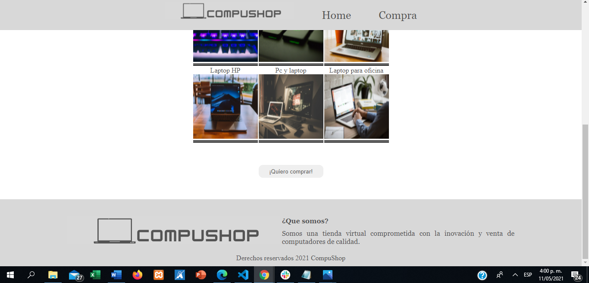

# 💎 Tienda de computadoras "CompuShop"


**Descripcion**&nbsp; &nbsp; &nbsp;&nbsp;

CompuShop es una tienda de computadoras que tiene descuentos a sus productos según alguno criterios que dependen de la cantidad que vayas a comprar, su algoritmo es muy eficaz y te ayudara averiguarlo.


Puedes verlo aquí: <https://jacksonguerrer0.github.io/descuentoTienda/index.html>

## Requerimientos

Se requiere un navegador, que puedas escribir y dar clic

## 🔥 Instalación

```shell
<Dale doble clic al archivo index.html>
<>
```

## 🔍 Vistas 

### 💻 Desktop



### 📱 Mobile

## 📌 Stack

## 🌟 Autor

* **Jackson Guerrero**  - [@jacksonguerrer0](https://github.com/jacksonguerrer0)
